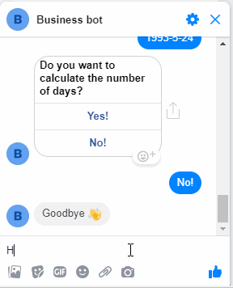

# Chatbot Messenger

### Prerequisites
- A Facebook [Developer](https://developers.facebook.com/) account is required to create an app
- A Facebook page is required (or if you don't have it you can create one by going to `facebook.com` > Click `Pages` (in the left panel) > Select the category of the page > Add details of the page > `Done`) to send and receive messages by bot
- Now go to Facebook [Developer](https://developers.facebook.com/) and create an app 
- After creating an app at facebook [developer](https://developers.facebook.com/). Open the created app and select `Platform` from left panel
- Select `Messenger` and click on `Set Up`
- Now under `Access Tokens` select your page from the dropdown and Click on `Edit Permissions` to give permission 
- Copy the access token and set in `app/services/constants.js`
- Click on `Subscribe to Event` button under `Webhooks`
- In `Callback URL` give your ngrok url and in `Verify Token` give the secret which you set in `app/services/constants.js` file as `VERIFY_TOKEN`
- Under `Subscription Fields` check all the fields
- FINAL STEP: Choose your page from the dropdown to subscribe it to webhooks 
- BONUS: make your app `Status: Live`


### ngrok Setup
- Download zip from [ngrok](https://ngrok.com/) website
- Extract the exe file and click on it  
- Now you will see a command line interface
- Type `ngrok http 1337` where `1337` is the port number 
- copy the http or https url and paste in your browser and you're ready to go 

### Getting Started


```sh
# clone it
git clone https://github.com/mkamranhamid/chatbot-messenger.git
cd chatbot-messenger

# Make it your own
rm -rf .git && git init && npm init

# Install dependencies
npm install
```

### Demo GIF


